<h1 align="left">Hi, I'm Romek 👋</h1>
<h3 align="left">
💻 Full-Stack Software Engineer (focused on PHP/Laravel) 
⚙️ I automate boring stuff with Python & n8n 
🧪 Nix enjoyer
</h2>

  <a href="mailto:contact@romek.codes" aria-label="Email me at contact@romek.codes">
    <picture>
      <source media="(prefers-color-scheme: dark)" srcset="https://api.iconify.design/lucide/mail.svg?color=%23fff&height=32">
      
    </picture>
  </a>&nbsp;
  <a href="https://discord.com/users/238750249483501568" aria-label="Add me on Discord (romek.codes)">
    <picture>
      <source media="(prefers-color-scheme: dark)" srcset="https://api.iconify.design/tabler/brand-discord.svg?color=%23fff&height=32">
      
    </picture>
  </a>

  
  

